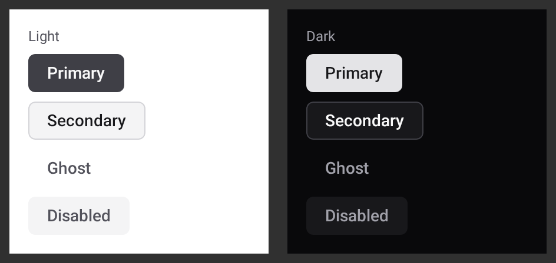

# Button

Source: [`UkptButton.kt`](../../src/commonMain/kotlin/platform/design/components/UkptButton.kt) ·
Doc surface: `UkptButtonDocTest.variants`



There is **one** button. Everything a project might reach for a second button composable to express
is a variant of this one, and if a case genuinely doesn't fit, that is a discussion about the
system — not a new file.

## Variants

| Variant | Use |
|---|---|
| `Primary` | The one action the screen wants. At most one per view. |
| `Secondary` | A real alternative to primary: "Cancel" beside "Save". |
| `Ghost` | Low-emphasis and usually repeated: a row action, a toolbar item. |

Two primaries on a screen means the screen hasn't decided what it is for. That is a design problem
the button cannot solve.

## Usage

```kotlin
UkptButton(
    label = "Save",
    onClick = viewModel::save,
    variant = UkptButtonVariant.Primary,
    enabled = state.canSave,
)
```

It is stateless: it renders `label` and reports `onClick`. It does not track pressed, loading or
selected state — the caller owns that. A button that kept its own `enabled` state would disagree
with the ViewModel exactly when it mattered.

There is no `loading` variant. A button that swaps its label for a spinner changes width and makes
the row jump; show progress at the surface that owns the work instead.

## Accessibility

The button is a bespoke clickable `Box`, not a material `Button`, so it sets `role = Role.Button`
explicitly. Without that it announces nothing to a screen reader while looking perfectly correct —
which is exactly the kind of bug no visual review catches.

Disabled state is conveyed by both colour *and* the control being unclickable, never by colour
alone.

## Rules

- One button. New needs become variants; a new primitive is a discussion.
- At most one `Primary` per screen.
- Never pass a literal colour or dimension — the variant decides the tokens.
- Keep it stateless; the caller owns pressed/loading/selected.
- Any new interactive primitive sets an explicit `role`, and a non-interactive state keeps its
  meaning in semantics rather than in colour.
- Changing appearance means re-recording `UkptButtonDocTest` in the same change. Renaming the test
  method renames its golden and breaks the embed above — `DesignSystemDocImagesTest` will fail.
